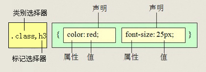

---

# 课程目标:

> 1. 学会使用CSS选择器
> 2. 熟记CSS样式和外观属性
> 3. 熟练掌握CSS各种选择器
> 4. 熟练掌握CSS各种选择器
> 5. 熟练掌握CSS三种显示模式
> 6. 熟练掌握CSS背景属性
> 7. 熟练掌握CSS三大特性
> 8. 熟练掌握CSS盒子模型
> 9. 熟练掌握CSS浮动
> 10.熟练掌握CSS定位
> 11.熟练掌握CSS高级技巧强化CSS
>    typora-copy-images-to: media
---

# CSS的发展历程

从HTML被发明开始，样式就以各种形式存在。不同的浏览器结合它们各自的样式语言为用户提供页面效果的控制。最初的HTML只包含很少的显示属性。
随着HTML的成长，为了满足页面设计者的要求，HTML添加了很多显示功能。但是随着这些功能的增加，HTML变的越来越杂乱，而且HTML页面也越来越臃肿。于是CSS便诞生了。

# CSS 网页的美容师

CSS的出现，拯救了混乱的HTML，当让更加拯救了我们web开发者。 让我们的网页更加丰富多彩。   

CSS的最大贡献就是：  让 HTML 从样式中解脱苦海，  实现了 HTML 专注去做 结构呈现。 而样式交给 CSS 后，你完全可以放心的早点洗洗睡了！

而且。。。。。 CSS 做的很出色，如果JavaScript是网页的魔法师，那么CSS它是我们网页的美容师

# CSS初识

CSS(Cascading Style Sheets)    美化样式

CSS通常称为CSS样式表或层叠样式表（级联样式表），主要用于设置HTML页面中的文本内容（字体、大小、对齐方式等）、图片的外形（宽高、边框样式、边距等）以及版面的布局等外观显示样式。

CSS以HTML为基础，提供了丰富的功能，如字体、颜色、背景的控制及整体排版等，而且还可以针对不同的浏览器设置不同的样式。

# 引入CSS样式表（书写位置）

CSS可以写到那个位置？ 是不是一定写到html文件里面呢？

## 内部样式表

内嵌式是将CSS代码集中写在HTML文档的head头部标签中，并且用style标签定义，其基本语法格式如下：

```html
<head>
<style type="text/CSS">
    选择器 {属性1:属性值1; 属性2:属性值2; 属性3:属性值3;}
</style>
</head>
```

语法中，style标签一般位于head标签中title标签之后，也可以把他放在HTML文档的任何地方。

type="text/CSS"  在html5中可以省略， 写上也比较符合规范， 所以这个地方可以写也可以省略。

## 行内式（内联样式）

内联样式，又有人称行内样式、行间样式、内嵌样式。是通过标签的style属性来设置元素的样式，其基本语法格式如下：

```html
<标签名 style="属性1:属性值1; 属性2:属性值2; 属性3:属性值3;"> 内容 </标签名>
```

语法中style是标签的属性，实际上任何HTML标签都拥有style属性，用来设置行内式。其中属性和值的书写规范与CSS样式规则相同，行内式只对其所在的标签及嵌套在其中的子标签起作用。


## 外部样式表（外链式）

链入式是将所有的样式放在一个或多个以.CSS为扩展名的外部样式表文件中，通过link标签将外部样式表文件链接到HTML文档中，其基本语法格式如下：

```html
<head>
  <link href="CSS文件的路径"  rel="stylesheet" />
</head>
```

注意：  link 是个单标签哦!!!

该语法中，link标签需要放在head头部标签中，并且必须指定link标签的三个属性，具体如下：

```
href：定义所链接外部样式表文件的URL，可以是相对路径，也可以是绝对路径。
type：定义所链接文档的类型，在这里需要指定为“text/CSS”，表示链接的外部文件为CSS样式表。
rel：定义当前文档与被链接文档之间的关系，在这里需要指定为“stylesheet”，表示被链接的文档是一个样式表文件。
```

## 三种样式表总结（位置）

| 样式表     | 优点                     | 缺点                     | 使用情况       | 控制范围           |
| ---------- | ------------------------ | ------------------------ | -------------- | ------------------ |
| 行内样式表 | 书写方便，权重高         | 没有实现样式和结构相分离 | 较少           | 控制一个标签（少） |
| 内部样式表 | 部分结构和样式相分离     | 没有彻底分离             | 较多           | 控制一个页面（中） |
| 外部样式表 | 完全实现结构和样式相分离 | 需要引入                 | 最多，强烈推荐 | 控制整个站点（多） |

# CSS样式规则

使用HTML时，需要遵从一定的规范。CSS亦如此，要想熟练地使用CSS对网页进行修饰，首先需要了解CSS样式规则，具体格式如下：      


```
在上面的样式规则中:

1.选择器用于指定CSS样式作用的HTML对象，花括号内是对该对象设置的具体样式。
2.属性和属性值以“键值对”的形式出现。
3.属性是对指定的对象设置的样式属性，例如字体大小、文本颜色等。
4.属性和属性值之间用英文“:”连接。
5.多个“键值对”之间用英文“;”进行区分。
可以用段落 和 表格的对齐的演示。
```

# 选择器（重点）

要想将CSS样式应用于特定的HTML元素，首先需要找到该目标元素。在CSS中，执行这一任务的样式规则部分被称为选择器（选择符）。


如上图所以，要把里面的小黄人分为2组，最快的方法怎办？  

很多， 比如 一只眼睛的一组，剩下的一组  


选择器干啥的？   选择标签用的

这就用到基础选择器组：

## CSS基础选择器

### 标签选择器（元素选择器）

标签选择器是指用HTML标签名称作为选择器，按标签名称分类，为页面中某一类标签指定统一的CSS样式。其基本语法格式如下：

```
标签名{属性1:属性值1; 属性2:属性值2; 属性3:属性值3; }  或者
元素名{属性1:属性值1; 属性2:属性值2; 属性3:属性值3; }
```

标签选择器最大的优点是能快速为页面中同类型的标签统一样式，同时这也是他的缺点，不能设计差异化样式。

标签选择器 可以把某一类标签全部选择出来  div  span  

课堂案例：

 传智简介

### 类选择器

类选择器使用“.”（英文点号）进行标识，后面紧跟类名，其基本语法格式如下：

```
.类名{属性1:属性值1; 属性2:属性值2; 属性3:属性值3; }
```

```
 标签调用的时候用 class=“类名”  即可。
```

类选择器最大的优势是可以为元素对象定义单独或相同的样式。 可以选择一个或者多个标签 

小技巧：

```
1.长名称或词组可以使用中横线来为选择器命名。
2.不建议使用“_”下划线来命名CSS选择器。
```

    输入的时候少按一个shift键;
　浏览器兼容问题 (比如使用_tips的选择器命名，在IE6是无效的)
　能良好区分JavaScript变量命名(JS变量命名是用“_”)

```
3.不要纯数字、中文等命名， 尽量使用英文字母来表示。
```

案例

```html
<head>
        <meta charset="utf-8">
        <style>
        span {
        	font-size: 100px;
        }
        .blue {
        	color: blue;
        }
        .red {
        	color: red;
        }
        .orange {
			color: orange;
        }
		.green {
			color: green;
		}
        </style>
    </head>
    <body>
    	<span class="blue">G</span>
    	<span class="red">o</span>
    	<span class="orange">o</span>
    	<span class="blue">g</span>
    	<span class="green">l</span>
    	<span class="red">e</span>
    </body>
```

### 多类名选择器

我们可以给标签指定多个类名，从而达到更多的选择目的。


注意：

```
1. 样式显示效果跟HTML元素中的类名先后顺序没有关系,受CSS样式书写的上下顺序有关。
2. 各个类名中间用空格隔开。
```

多类名选择器在后期布局比较复杂的情况下，还是较多使用的。

```html
<div class="pink fontWeight font20">亚瑟</div>
<div class="font20">刘备</div>
<div class="font14 pink">安其拉</div>
<div class="font14">貂蝉</div>
```

### id选择器

id选择器使用“#”进行标识，后面紧跟id名，其基本语法格式如下：

```
#id名{属性1:属性值1; 属性2:属性值2; 属性3:属性值3; }
```

该语法中，id名即为HTML元素的id属性值，大多数HTML元素都可以定义id属性，元素的id值是唯一的，只能对应于文档中某一个具体的元素。

用法基本和类选择器相同。

### id选择器和类选择器区别

W3C标准规定，在同一个页面内，不允许有相同名字的id对象出现，但是允许相同名字的class。

类选择器（class） 好比人的名字，  是可以多次重复使用的， 比如  张伟  王伟  李伟  李娜

id选择器     好比人的身份证号码，  全中国是唯一的， 不得重复。 只能使用一次。

***id选择器和类选择器最大的不同在于 使用次数上。***


### 通配符选择器

通配符选择器用“*”号表示，他是所有选择器中作用范围最广的，能匹配页面中所有的元素。其基本语法格式如下：

```html
* { 属性1:属性值1; 属性2:属性值2; 属性3:属性值3; }
```

例如下面的代码，使用通配符选择器定义CSS样式，清除所有HTML标记的默认边距。

```css
* {
  margin: 0;                    /* 定义外边距*/
  padding: 0;                   /* 定义内边距*/
}
```

注意：

  这个通配符选择器，就像我们的电影明星中的梦中情人， 想想它就好了，但是它不会和你过日子。 

## CSS复合选择器

复合选择器是由两个或多个基础选择器，通过不同的方式组合而成的,目的是为了可以选择更准确更精细的目标元素标签。

### 交集选择器

交集选择器由两个选择器构成，其中第一个为标签选择器，第二个为class选择器，两个选择器之间不能有空格，如h3.special。


**记忆技巧：**

交集选择器 是 并且的意思。  即...又...的意思

```
比如：   p.one   选择的是： 类名为 .one  的 段落标签。  
```

用的相对来说比较少，不太建议使用。

### 并集选择器

并集选择器（CSS选择器分组）是各个选择器通过<strong style="color:#f00">逗号</strong>连接而成的，任何形式的选择器（包括标签选择器、class类选择器id选择器等），都可以作为并集选择器的一部分。如果某些选择器定义的样式完全相同，或部分相同，就可以利用并集选择器为它们定义相同的CSS样式。



记忆技巧：

并集选择器  和 的意思，  就是说，只要逗号隔开的，所有选择器都会执行后面样式。

```
比如  .one, p , #test {color: #F00;}  表示   .one 和 p  和 #test 这三个选择器都会执行颜色为红色。  通常用于集体声明。
```


### 后代选择器

后代选择器又称为包含选择器，用来选择元素或元素组的后代，其写法就是把外层标签写在前面，内层标签写在后面，中间用空格分隔。当标签发生嵌套时，内层标签就成为外层标签的后代。


子孙后代都可以这么选择。 或者说，它能选择任何包含在内 的标签。 


### 子元素选择器

子元素选择器只能选择作为某元素子元素的元素。其写法就是把父级标签写在前面，子级标签写在后面，中间跟一个 &gt; 进行连接，注意，符号左右两侧各保留一个空格。


白话：  这里的子 指的是 亲儿子  不包含孙子 重孙子之类。

```
 比如：  .demo > h3 {color: red;}   说明  h3 一定是demo 亲儿子。  demo 元素包含着h3。
```

### 测试题

```html
<div class="nav">    <!-- 主导航栏 -->
  <ul>
    <li><a href="#">公司首页</a></li>
	<li><a href="#">公司简介</a></li>
	<li><a href="#">公司产品</a></li>
	<li>
         <a href="#">联系我们</a>
		 <ul>
		    		<li><a href="#">公司邮箱</a></li>
		    		<li><a href="#">公司电话</a></li>
		 </ul>
	</li>
  </ul>
</div>
<div class="sitenav">    <!-- 侧导航栏 -->
  <div class="site-l">左侧侧导航栏</div>
  <div class="site-r"><a href="#">登录</a></div>
</div>
```

在不修改以上代码的前提下，完成以下任务：

1. 链接 登录 的颜色为红色,同时主导航栏里面的所有的链接改为蓝色     (简单)
2. 主导航栏和侧导航栏里面文字都是14像素并且是微软雅黑。（中等)
3. 主导航栏里面的一级菜单链接文字颜色为绿色。（难)

### 伪类选择器

  伪类选择器用于向某些选择器添加特殊的效果。比如给链接添加特殊效果， 比如可以选择 第1个，第n个元素。

```css
为了和我们刚才学的类选择器相区别，  类选择器是一个点 比如 .demo {}   而我们的伪类 用 2个点 就是 冒号  比如  :link{}
```

### 链接伪类选择器

- :link      /* 未访问的链接 */
- :visited   /* 已访问的链接 */
- :hover     /* 鼠标移动到链接上 */
- :active    /* 选定的链接 */

   注意写的时候，他们的顺序尽量不要颠倒  按照  lvha 的顺序。   love   hate  爱上了讨厌 记忆法    或者   lv 包包 非常 hao 

```css
a {   /* a是标签选择器  所有的链接 */
			font-weight: 700;
			font-size: 16px;
			color: gray;
		}
a:hover {   /* :hover 是链接伪类选择器 鼠标经过 */
			color: red; /*  鼠标经过的时候，由原来的 灰色 变成了红色 */
}
```

# CSS注释

```css
CSS规则是使用     /*  需要注释的内容  */  进行注释的，即在需要注释的内容前使用 “/*” 标记开始注释，在内容的结尾使用 “*/”结束。
```

   例如：

```css
p {
  font-size: 14px;                 /* 所有的字体是14像素大小*/
}
```

# css字体样式属性

**font-size:字体大小**

font-size属性用于设置字号，该属性的值可以使用相对长度单位，也可以使用绝对长度单位，其中，相对长度单位比较常用，推荐使用像素单位px;


**font-family:字体**

网页中常用的字体有宋体、微软雅黑、黑体等，可以同时指定多个字体，则会尝试下一个，直到找到合适的字体。

 常用技巧：

1. 现在网页中普遍使用14px+。
2. 尽量使用偶数的数字字号。ie6等老式浏览器支持技术会有bug
3. 各种字体之间必须使用英文状态下的逗号隔开
4. 中文字体需要加英文状态下的引号，英文字体一般不需要加引号。当需要设置英文字体时，英文字体名字必须位于英文字体名之前
5. 如果字体名中包含空格，#，$，等特殊符号，则该字体必须加英文状态下的单引号或双引号。例如font-family: "Times New Roman";。
6. 尽量使用系统默认字体，保证在任何用户的浏览器中都能正常显示

**CSS Unicode字体**

在 CSS 中设置字体名称，直接写中文是可以的。但是在文件编码（GB2312、UTF-8 等）不匹配时会产生乱码的错误。xp 系统不支持 类似微软雅黑的中文。

方案一： 你可以使用英文来替代。 比如 font-family:"Microsoft Yahei"。

方案二： 在 CSS 直接使用 Unicode 编码来写字体名称可以避免这些错误。使用 Unicode 写中文字体名称，浏览器是可以正确的解析的。
font-family: "\5FAE\8F6F\96C5\9ED1"，表示设置字体为“微软雅黑”。


可以通过escape()  来测试属于什么字体。

| 字体名称    | 英文名称        | Unicode 编码         |
| ----------- | --------------- | -------------------- |
| 宋体        | SimSun          | \5B8B\4F53           |
| 新宋体      | NSimSun         | \65B0\5B8B\4F53      |
| 黑体        | SimHei          | \9ED1\4F53           |
| 微软雅黑    | Microsoft YaHei | \5FAE\8F6F\96C5\9ED1 |
| 楷体_GB2312 | KaiTi_GB2312    | \6977\4F53_GB2312    |
| 隶书        | LiSu            | \96B6\4E66           |
| 幼园        | YouYuan         | \5E7C\5706           |
| 华文细黑    | STXihei         | \534E\6587\7EC6\9ED1 |
| 细明体      | MingLiU         | \7EC6\660E\4F53      |
| 新细明体    | PMingLiU        | \65B0\7EC6\660E\4F53 |

为了照顾不同电脑的字体安装问题，我们尽量只使用宋体和微软雅黑中文字体

**font-weight:字体粗细**

字体加粗除了用 b  和 strong 标签之外，可以使用CSS 来实现，但是CSS 是没有语义的。

```html
font-weight属性用于定义字体的粗细，其可用属性值：normal、bold、bolder、lighter、100~900（100的整数倍）。
```

小技巧： 

```css
数字 400 等价于 normal，而 700 等价于 bold。  但是我们更喜欢用数字来表示。  
```

**font-style:字体风格**

字体倾斜除了用 i  和 em 标签之外，可以使用CSS 来实现，但是CSS 是没有语义的。

font-style属性用于定义字体风格，如设置斜体、倾斜或正常字体，其可用属性值如下：

normal：默认值，浏览器会显示标准的字体样式。

italic：浏览器会显示斜体的字体样式。

oblique：浏览器会显示倾斜的字体样式。

小技巧： 

```css
平时我们很少给文字加斜体，反而喜欢给斜体标签（em，i）改为普通模式。
```

**font:综合设置字体样式 (重点)**

font属性用于对字体样式进行综合设置，其基本语法格式如下：

```css
选择器{font: font-style  font-weight  font-size/line-height  font-family;}
```

```css
使用font属性时，必须按上面语法格式中的顺序书写，不能更换顺序，各个属性以空格隔开。

注意：其中不需要设置的属性可以省略（取默认值），但必须保留font-size和font-family属性，否则font属性将不起作用。
```

# CSS外观属性

## text-decoration 文本的装饰

text-decoration   通常我们用于给链接修改装饰效果

| 值           | 描述                                          |
| ------------ | --------------------------------------------- |
| none         | 默认。定义标准的文本。                        |
| underline    | 定义文本下的一条线。下划线 也是我们链接自带的 |
| overline     | 定义文本上的一条线。                          |
| line-through | 定义穿过文本下的一条线。                      |
|              |                                               |
|              |                                               |

## 标签显示模式（display）

### 块级元素(block-level)

每个块元素通常都会独自占据一整行或多整行，可以对其设置宽度、高度、对齐等属性，常用于网页布局和网页结构的搭建。 霸道

```css
常见的块元素有<h1>~<h6>、<p>、<div>、<ul>、<ol>、<li>等，其中<div>标签是最典型的块元素。
```

块级元素的特点：

（1）总是从新行开始

（2）高度，行高、外边距以及内边距都可以控制。

（3）宽度默认是容器的100%

（4）可以容纳内联元素和其他块元素。

### 行内元素(inline-level)

行内元素（内联元素）不占有独立的区域，仅仅靠自身的字体大小和图像尺寸来支撑结构，一般不可以设置宽度、高度、对齐等属性，常用于控制页面中文本的样式。

```
常见的行内元素有<a>、<strong>、<b>、<em>、<i>、<del>、<s>、<ins>、<u>、<span>等，其中<span>标签最典型的行内元素。
```

行内元素的特点：

（1）和相邻行内元素在一行上。

（2）高、宽无效，但水平方向的padding和margin可以设置，垂直方向的无效。

（3）默认宽度就是它本身内容的宽度。

（4）行内元素只能容纳文本或则其他行内元素。（a特殊）

      注意：

1. 只有 文字才 能组成段落  因此 p  里面不能放块级元素，同理还有这些标签h1,h2,h3,h4,h5,h6,dt，他们都是文字类块级标签，里面不能放其他块级元素。
2. 链接里面不能再放链接。


### 块级元素和行内元素区别

```
块级元素的特点：
（1）总是从新行开始
（2）高度，行高、外边距以及内边距都可以控制。
（3）宽度默认是容器的100%
（4）可以容纳内联元素和其他块元素。
```

```
行内元素的特点：
（1）和相邻行内元素在一行上。
（2）高、宽无效，但水平方向的padding和margin可以设置，垂直方向的无效。
（3）默认宽度就是它本身内容的宽度。
（4）行内元素只能容纳文本或则其他行内元素。
```

### 行内块元素（inline-block）

```
在行内元素中有几个特殊的标签——、<input />、<td>，可以对它们设置宽高和对齐属性，有些资料可能会称它们为行内块元素。

行内块元素的特点：
（1）和相邻行内元素（行内块）在一行上,但是之间会有空白缝隙。
（2）默认宽度就是它本身内容的宽度。
（3）高度，行高、外边距以及内边距都可以控制。

```

### 标签显示模式转换 display

块转行内：display:inline;

行内转块：display:block;

块、行内元素转换为行内块： display: inline-block;

此阶段，我们只需关心这三个，其他的是我们后面的工作。

### 课堂练习

1.写 三个 div  给定 100 * 100 的红色盒子     --  宽度 高度  背景色 

2.三个 span   也要求  150 * 150 绿色盒子 

1. 三个  a 链接   80 * 20  蓝色 盒子  要求 必须一行显示 这三个盒子
2. 鼠标经过3个a链接的时候， 背景颜色变为  橙色     hover   bgc
3. 导航栏案例

# CSS 三大特性

层叠 继承  优先级 是我们学习CSS 必须掌握的三个特性。

## CSS层叠性

所谓层叠性是指多种CSS样式的叠加。

是浏览器处理冲突的一个能力,如果一个属性通过两个相同选择器设置到同一个元素上，那么这个时候一个属性就会将另一个属性层叠掉

比如先给某个标签指定了内部文字颜色为红色，接着又指定了颜色为蓝色，此时出现一个标签指定了相同样式不同值的情况，这就是样式冲突。

一般情况下，如果出现样式冲突，则会按照CSS书写的顺序，以最后的样式为准。

1. 样式冲突，遵循的原则是就近原则。 那个样式离着结构近，就执行那个样式。
2. 样式不冲突，不会层叠

```
CSS最后的执行口诀：  长江后浪推前浪，前浪死在沙滩上。

```

## CSS继承性

所谓继承性是指书写CSS样式表时，子标签会继承父标签的某些样式，如文本颜色和字号。想要设置一个可继承的属性，只需将它应用于父元素即可。

简单的理解就是：  子承父业。

```
CSS最后的执行口诀：  龙生龙，凤生凤，老鼠生的孩子会打洞。

```

## CSS优先级

定义CSS样式时，经常出现两个或更多规则应用在同一元素上，这时就会出现优先级的问题。

在考虑权重时，初学者还需要注意一些特殊的情况，具体如下：

```
继承样式的权重为0。即在嵌套结构中，不管父元素样式的权重多大，被子元素继承时，他的权重都为0，也就是说子元素定义的样式会覆盖继承来的样式。

行内样式优先。应用style属性的元素，其行内样式的权重非常高，可以理解为远大于100。总之，他拥有比上面提高的选择器都大的优先级。

权重相同时，CSS遵循就近原则。也就是说靠近元素的样式具有最大的优先级，或者说排在最后的样式优先级最大。

CSS定义了一个!important命令，该命令被赋予最大的优先级。也就是说不管权重如何以及样式位置的远近，!important都具有最大优先级。

```

## CSS特殊性（Specificity）

关于CSS权重，我们需要一套计算公式来去计算，这个就是 CSS Specificity，我们称为CSS 特性或称非凡性，它是一个衡量CSS值优先级的一个标准 具体规范入如下：

specificity用一个四位的数 字串(CSS2是三位)来表示，更像四个级别，值从左到右，左面的最大，一级大于一级，数位之间没有进制，级别之间不可超越。 

| 继承或者* 的贡献值       | 0,0,0,0  |
| ------------------------ | -------- |
| 每个元素（标签）贡献值为 | 0,0,0,1  |
| 每个类，伪类贡献值为     | 0,0,1,0  |
| 每个ID贡献值为           | 0,1,0,0  |
| 每个行内样式贡献值       | 1,0,0,0  |
| 每个!important贡献值     | ∞ 无穷大 |


权重是可以叠加的

 比如的例子：

```
div ul  li   ------>      0,0,0,3

.nav ul li   ------>      0,0,1,2

a:hover      -----—>      0,0,1,1

.nav a       ------>      0,0,1,1   

#nav p       ----->       0,1,0,1

```

   注意： 

1.数位之间没有进制 比如说： 0,0,0,5 + 0,0,0,5 =0,0,0,10 而不是 0,0, 1, 0， 所以不会存在10个div能赶上一个类选择器的情况。

1. 继承的 权重是 0

总结优先级：

1. 使用了 !important声明的规则。
2. 内嵌在 HTML 元素的 style属性里面的声明。
3. 使用了 ID 选择器的规则。
4. 使用了类选择器、属性选择器、伪元素和伪类选择器的规则。
5. 使用了元素选择器的规则。
6. 只包含一个通用选择器的规则。
7. 同一类选择器则遵循就近原则。

```
总结：权重是优先级的算法，层叠是优先级的表现

```

