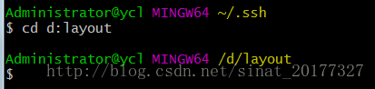
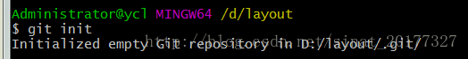
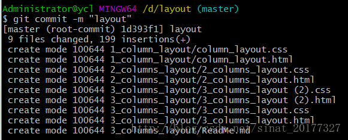
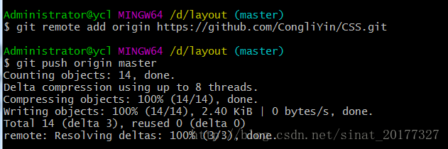

# Git是什么？

Git是一个开源的分布式版本控制系统，用于敏捷高效地处理任何或小或大的项目。

Git 是 Linus Torvalds 为了帮助管理 Linux 内核开发而开发的一个开放源码的版本控制软件。

Git 与常用的版本控制工具 CVS, Subversion 等不同，它采用了分布式版本库的方式，不必服务器端软件支持。

# 在Windows上安装Git

在Windows上使用Git，可以从Git官网直接[下载安装程序](https://git-scm.com/downloads)，（网速慢的同学请移步[国内镜像](https://pan.baidu.com/s/1kU5OCOB#list/path=%2Fpub%2Fgit)），然后按默认选项安装即可。

安装完成后，在开始菜单里找到“Git”->“Git Bash”，蹦出一个类似命令行窗口的东西，就说明Git安装成功！

安装完成后，还需要最后一步设置，在命令行输入：

```html
$ git config --global user.name "Your Name"
$ git config --global user.email "email@example.com"
```

# git的使用方法

使用Git前，需要先建立一个仓库(repository)。您可以使用一个已经存在的目录作为Git仓库或创建一个空目录。

使用您当前目录作为Git仓库，我们只需使它初始化。

```
git init
```

瞬间Git就把仓库建好了，而且告诉你是一个空的仓库（empty Git repository），细心的读者可以发现当前目录下多了一个`.git`的目录，这个目录是Git来跟踪管理版本库的，没事千万不要手动修改这个目录里面的文件，不然改乱了，就把Git仓库给破坏了。

如果你没有看到`.git`目录，那是因为这个目录默认是隐藏的，用`ls -ah`命令就可以看见。

使用我们指定目录作为Git仓库。

```
git init newrepo
```

## 用git存一个文件

找到Git bash，双击打开

### 输入自己的用户名和邮箱

（为注册GITHUB账号时的用户名和邮箱）

```
 $ git config --global user.name "coliyin@163.com"
 $ git config --global user.email "coliyin@163.com"
```

### 创建SSH Key。

众所周知ssh是加密传输。加密传输的算法有好多，git可使用rsa，rsa要解决的一个核心问题是，如何使用一对特定的数字，使其中一个数字可以用来加密，而另外一个数字可以用来解密。这两个数字就是你在使用git和github的时候所遇到的public key也就是公钥以及private key私钥。

其中，公钥就是那个用来加密的数字，这也就是为什么你在本机生成了公钥之后，要上传到github的原因。从github发回来的，用那公钥加密过的数据，可以用你本地的私钥来还原。

我们首先检验本机是否生成密钥，执行命令：

如果你的key丢失了，不管是公钥还是私钥，丢失一个都不能用了，解决方法也很简单，重新再生成一次，然后在github.com里再设置一次就行。

```
$ cd ~/.ssh
$ ls
```

若结果如下，则说明密钥已存在。


如果没有密钥，则执行以下命令来生成密钥：

$ ssh-keygen -t rsa -C "coliyin@163.com"

如果一切顺利的话，可以在用户主目录里找到`.ssh`目录，里面有`id_rsa`和`id_rsa.pub`两个文件，这两个就是SSH Key的秘钥对，`id_rsa`是私钥，不能泄露出去，`id_rsa.pub`是公钥，可以放心地告诉任何人。

### 为github账号配置SSH key
接下来，切换到个人github账号里，点击右上角用户头像下的小三角，找到setting，在右侧菜单栏中找到SSH and GPG keys，选择new SSH key，输入title，下面key的内容就是本机ssh key 公钥，直接将id_rsa.pub中的内容粘贴过来就可以，然后点击下面的add SSH key即可完成。


为什么GitHub需要SSH Key呢？因为GitHub需要识别出你推送的提交确实是你推送的，而不是别人冒充的，而Git支持SSH协议，所以，GitHub只要知道了你的公钥，就可以确认只有你自己才能推送。

当然，GitHub允许你添加多个Key。假定你有若干电脑，你一会儿在公司提交，一会儿在家里提交，只要把每台电脑的Key都添加到GitHub，就可以在每台电脑上往GitHub推送了。

最后友情提示，在GitHub上免费托管的Git仓库，任何人都可以看到喔（但只有你自己才能改）。所以，不要把敏感信息放进去。

如果你不想让别人看到Git库，有两个办法，一个是交点保护费，让GitHub把公开的仓库变成私有的，这样别人就看不见了（不可读更不可写）。另一个办法是自己动手，搭一个Git服务器，因为是你自己的Git服务器，所以别人也是看不见的。这个方法我们后面会讲到的，相当简单，公司内部开发必备。

### 上传本地文件

#### 创建一个本地文件

#### 建立本地仓库

首先进入目标文件夹：



执行指令进行初始化，会在原始文件夹中生成一个隐藏的文件夹.git：

```
 $  git init
```



执行指令将文件添加到本地仓库：

```git
$ git add .         //添加当前文件夹下的所有文件
$ git add **.cpp    //添加当前文件夹下的**.cpp这个文件
```

执行上面的命令，没有任何显示，这就对了，Unix的哲学是“没有消息就是好消息”，说明添加成功。

#### 提交版本

输入本次的提交说明，准备提交暂存区中的更改的已跟踪文件，单引号内为说明内容：

```js
$ git commit -m "layout"  //引号中的内容为对该文件的描述
```



简单解释一下`git commit`命令，`-m`后面输入的是本次提交的说明，可以输入任意内容，当然最好是有意义的，这样你就能从历史记录里方便地找到改动记录。

嫌麻烦不想输入`-m "xxx"`行不行？确实有办法可以这么干，但是强烈不建议你这么干，因为输入说明对自己对别人阅读都很重要。实在不想输入说明的童鞋请自行Google，我不告诉你这个参数。

`git commit`命令执行成功后会告诉你，`1 file changed`：1个文件被改动（我们新添加的readme.txt文件）；`2 insertions`：插入了两行内容（readme.txt有两行内容）。

#### 修改版本

我们已经成功地添加并提交了一个readme.txt文件，现在，是时候继续工作了，于是，我们继续修改readme.txt文件，改成如下内容：

```
Git is a distributed version control system.
Git is free software.
```

当我们修改了很多文件，而不想每一个都add，想commit自动来提交本地修改，我们可以使用-a标识。

```
git commit -a -m "Changed some files"
```

git commit 命令的-a选项可将所有**被修改或者已删除的且已经被git管理的文档**提交到仓库中。

千万注意，-a不会造成新文件被提交，只能修改。

现在，运行`git status`命令看看结果：

```
$ git status
On branch master
Changes not staged for commit:
  (use "git add <file>..." to update what will be committed)
  (use "git checkout -- <file>..." to discard changes in working directory)

    modified:   readme.txt

no changes added to commit (use "git add" and/or "git commit -a")
```

`git status`命令可以让我们时刻掌握仓库当前的状态，上面的命令输出告诉我们，`readme.txt`被修改过了，但还没有准备提交的修改。

虽然Git告诉我们`readme.txt`被修改了，但如果能看看具体修改了什么内容，自然是很好的。比如你休假两周从国外回来，第一天上班时，已经记不清上次怎么修改的`readme.txt`，所以，需要用`git diff`这个命令看看：

```
$ git diff readme.txt 
diff --git a/readme.txt b/readme.txt
index 46d49bf..9247db6 100644
--- a/readme.txt
+++ b/readme.txt
@@ -1,2 +1,2 @@
-Git is a version control system.
+Git is a distributed version control system.
 Git is free software.
```

`git diff`顾名思义就是查看difference，显示的格式正是Unix通用的diff格式，可以从上面的命令输出看到，我们在第一行添加了一个`distributed`单词。

知道了对`readme.txt`作了什么修改后，再把它提交到仓库就放心多了，提交修改和提交新文件是一样的两步，第一步是`git add`：

```
$ git add readme.txt
```

同样没有任何输出。在执行第二步`git commit`之前，我们再运行`git status`看看当前仓库的状态：

```
$ git status
On branch master
Changes to be committed:
  (use "git reset HEAD <file>..." to unstage)

    modified:   readme.txt
```

`git status`告诉我们，将要被提交的修改包括`readme.txt`，下一步，就可以放心地提交了：

```
$ git commit -m "add distributed"
[master e475afc] add distributed
 1 file changed, 1 insertion(+), 1 deletion(-)
```

提交后，我们再用`git status`命令看看仓库的当前状态：

```
$ git status
On branch master
nothing to commit, working tree clean
```

Git告诉我们当前没有需要提交的修改，而且，工作目录是干净（working tree clean）的。

小结

- 要随时掌握工作区的状态，使用`git status`命令。
- 如果`git status`告诉你有文件被修改过，用`git diff`可以查看修改内容。

#### 添加远程库

现在的情景是，你已经在本地创建了一个Git仓库后，又想在GitHub创建一个Git仓库，并且让这两个仓库进行远程同步，这样，GitHub上的仓库既可以作为备份，又可以让其他人通过该仓库来协作，真是一举多得。

首先，登陆GitHub，然后，在右上角找到“New repository”按钮，创建一个新的仓库：

在Repository name填入`learngit`，其他保持默认设置，点击“Create repository”按钮，就成功地创建了一个新的Git仓库：

目前，在GitHub上的这个`learngit`仓库还是空的，GitHub告诉我们，可以从这个仓库克隆出新的仓库，也可以把一个已有的本地仓库与之关联，然后，把本地仓库的内容推送到GitHub仓库。

现在，我们根据GitHub的提示，在本地的`learngit`仓库下运行命令：

```
$ git remote add origin git@github.com:git账户名/learngit.git
```

添加后，远程库的名字就是`origin`，这是Git默认的叫法，也可以改成别的，但是`origin`这个名字一看就知道是远程库。

注意：

如果出现错误：fatal: remote origin already exists，则执行以下语句：

```
 $ git remote rm origin
```

再重新执行：

```
$ git remote add origin git@github.com:git账户名/learngit.git
```

即可成功。

#### 提交远程库

下一步，就可以把本地库的所有内容推送到远程库上：

```
$ git push -u origin master
```

把本地库的内容推送到远程，用`git push`命令，实际上是把当前分支`master`推送到远程。

由于远程库是空的，我们第一次推送`master`分支时，加上了`-u`参数，Git不但会把本地的`master`分支内容推送的远程新的`master`分支，还会把本地的`master`分支和远程的`master`分支关联起来，在以后的推送或者拉取时就可以简化命令。



刷新github，即可看到上传的文件夹。