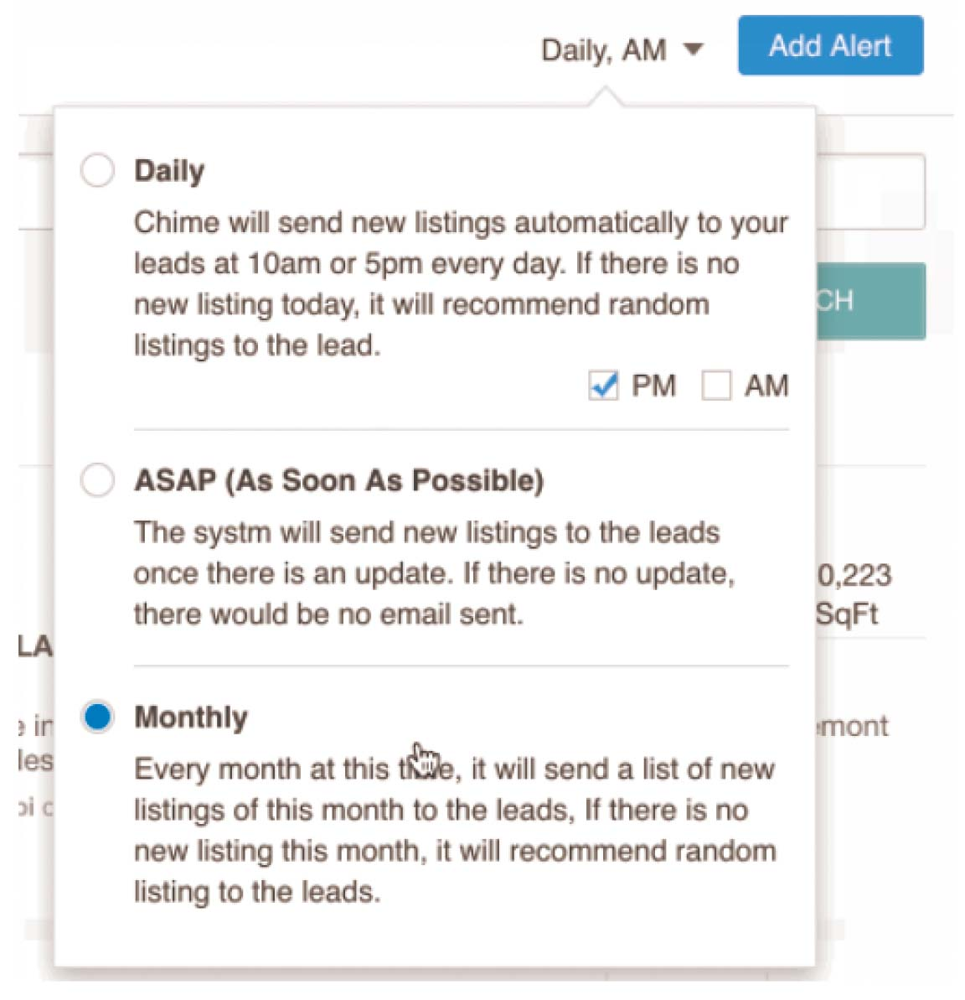
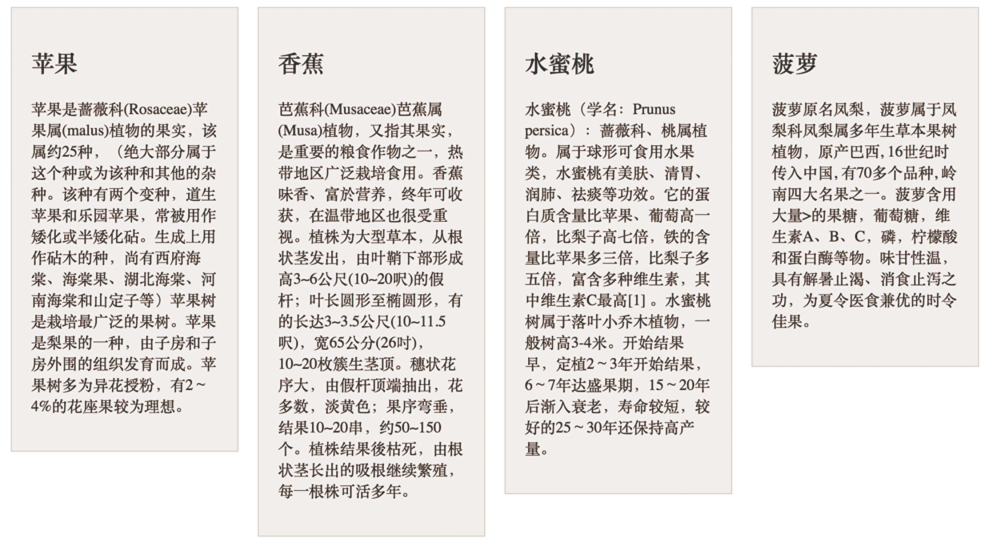
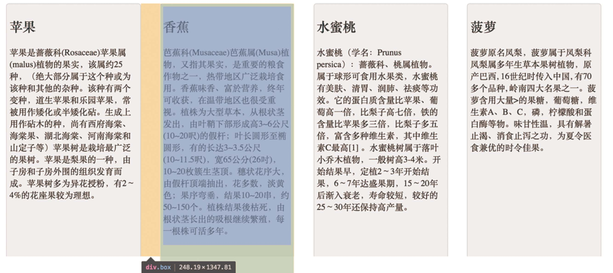
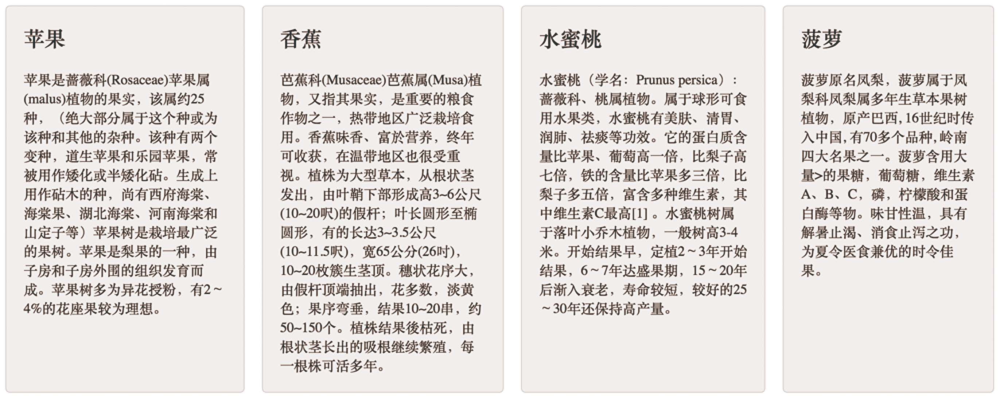
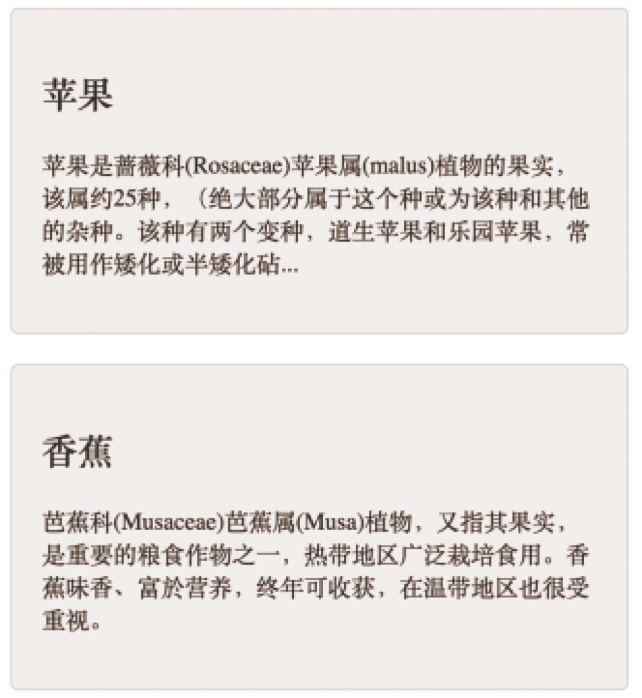

```
自定义radio/checkbox的样式
```

## 自定义radio/checkbox的样式

### css3自定义(兼容ie8上)

使用原生的radio/checkbox是不可以改变它的样式，得用div/span去画，然后再去监听单击事件。但是这样需要自己去写逻辑控制，例如实现radio按钮单选的功能，另外没有办法使用原生的change事件，没有用原生来的方便。

但是实际上可以用一点css技巧来实现自定义的目的,如图:



这主要是借助css3提供的一个伪类：checked，只要radio/checkbox是选中状态，这个伪类就会生效，因此可以利用选中和非选中这两种状态，去切换不同的样式。上图记录是把一个checkbox和一个用来自定义样式的span写在一个label里面，同事checkbox始终隐藏。

```html
<body>
	<label>
    	<input type="checkbox">
        <span class="checkbox"></span>
    </label>
</body>
<style>
    input[type=checkbox] {
        display:none;
    }
    .checkbox {
        width:10px;
        height:10px;
        background:red;
        border-radius:50%;
    }
    /* 选中时 */
    input[type=checkbox]:checked+.checkbox{
        background:blue;
    }
</style>
```

**checked兼容ie8以上，只要可以用nth-of-type,就可以用:checked。**

### js控制（全兼容）

```html
<style>
    body { margin: 0; }
    input { padding: 0; margin: 0; border: 0; }
    .female,.male { position: relative; /* 设置为相对定位，以便让子元素能绝对定位 */ height: 40px; line-height: 40px; margin-left: 40px; }
    .sex label { display: block; height: 40px; width: 40px; line-height: 40px; font-size: 20px; cursor: pointer; }
    .sex input { z-index: 3; position: absolute; top: 0; bottom: 0; left: 40px; margin: auto; /* 这里及以上的定位，可以让该元素竖直居中。(top: 0; bottom: 0;) */ opacity: 0; display: block; width: 30px; height: 30px; cursor: pointer; }
    .sex span { position: absolute; top: 0; bottom: 0; left: 40px; margin: auto; display: block; width: 25px; height: 25px; border: 1px solid #000; border-radius: 50%; cursor: pointer; }
    .sex span.active { background-color: #000;padding:-5px; }
</style>
<body>
    <form action="">
        <div class="sex">
            <div class="female">
                <label for="female">女</label>
                <input type="radio" name="sex" id="female">
                <span class="female-custom"></span> 
            </div>
            <div class="male">
                <label for="male">男</label>
                <input type="radio" name="sex" id="male">
                <span class="male-custom"></span> 
            </div>
        </div>
    </form>
    <script>
        $("#male").click( function () {
            $(this).siblings("span").addClass("active");
            $(this).parents("div").siblings("div").children("span").removeClass("active");
        });
        $("#female").click( function () {
            $(this).siblings("span").addClass("active");
            $(this).parents("div").siblings("div").children("span").removeClass("active");
        });
    </script>
</body>
```

## 多列等高

排成一行的几列由于内容长短不一致，导致容器的高度不一致



### js

```js

jQuery(``".js-equalheight"``).height(maxHeight);
}jQuery( document ).ready(function() {
  equalheight();
});
jQuery(window).resize(function() {
  jQuery('.js-equalheight').css('height','auto');
  equalheight();
});
function equalheight() {
  var heights = jQuery(".js-equalheight").map(function() {
  return jQuery(this).height();
  }).get(),
maxHeight = Math.max.apply(null, heights);
    jQuery(".js-equalheight").height(maxHeight);
}
```

可以用js计算一下，以最高一列的高度去设置所有列的高度，然而这**会造成页面闪动**，刚开始打开页面的时候高度不一致，然后突然又对齐了。解决办法主要有三种：

### padding,margin

- 第一种是每列来一个很大的padding,再来一个很大的负的margin值矫正回去，就对齐了

```html
<style>
    .wrapper > div{
        float: left;
        padding-bottom: 900px;
        margin-bottom: -880px;
        background-color: #ececec;
        border: 1px solid #ccc;
    }
</style>
<div class="wrapper">
    <div>column 1</div>
    <div>column 2</div>
    <div>column 3</div>
    <div>column 4</div>
</div>
```

如图



你会发现，这样做是对齐了，但是底部的border没有了，设置的圆角也不起作用了，究其原因，是因为设置了一个很大的padding值，导致它的高度变得很大，如图1-9所示。所以如果你想在底部用absolute定位放一个链接“更多>>”是实现不了的。

### table

- 第二种办法是借助table的自适应特性，每个div都是一个td，td肯定是等高的，HTML结构不变，CSS改一下：

```css
.wrapper{
    display: table;
    border-spacing: 20px;  /* td间的间距*/
}
 
.wrapper > div {
    display: table-cell;
    width: 1000px;         /*设置很大的宽度，table自动平分宽度 */
    border-radius: 5px;    /*这里设置圆角就正常了*/
}
```

效果如图



这里还有一个好处，就是在响应式开发的时候，可以借助媒体查询动态改变diaplay的属性。例如在小于500px时，每一列占满一行，那么只要把display:table-cell覆盖掉就好了

```css
@media (max-width: 500px){
    .wrapper{
        display: block;
    }
    .wrapper > div{
        display: block;
        width: 100%;
    }
}
```

如图所示



如果在宽为1024px的设备上，希望一行显示两个，那应该怎么办呢？由于上面用的是td，必定会排在同一行。其实可以在第二个和第三个中间加一个tr，让它换行即可

```html
<div class="wrapper">
    <div>column 1</div>
    <div>column 2</div>
    <span class="tr"></span>
    <div>column 3</div>
    <div>column 4</div>
</div>
<!-- 在大屏和小屏时，tr是不显示的，而在中屏时，tr是显示的 -->
<style>
    tr{
        display: none;
    }
    @media (max-width: 1024px) and (min-width: 501px){
        .tr{
            display: table-row;
        }
    }
</style>
```

这样就能够实现在小屏时一行排两列了，只是这里有个小问题，就是在中屏拉到大屏的时候tr的dipslay：none已经没有什么作用，因为table的布局已经计算好。但是一般应该不用考虑这种拉伸范围很大的情况，正常刷新页面是可以的，如果真要解决则要借助JS。

https://www.jb51.net/css/68810.html

### flexbox