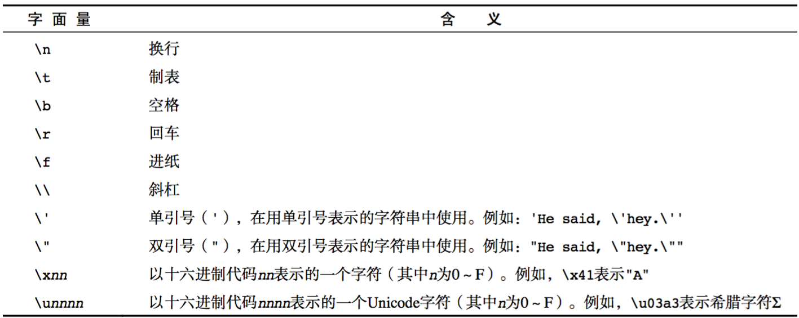

```html
javascript的介绍、组成、变量、事件、规范、数据类型。

元素的获取，计算机的软件和硬件
```


## 演示JavaScript的强大

http://impress.github.io/impress.js/
http://naotu.baidu.com/ 
https://codecombat.com/
https://ide.codemao.cn/

需要翻墙
https://developers.google.com/blockly/
blockly迷宫
https://blockly-games.appspot.com

blockly迷宫不需要翻墙
https://blockly.uieee.com/

## 计算机语言

计算机语言就是一系列的指令，这些指令告诉计算机如何做事情。这些指令可以广泛地包含各种操作，包括显示文本信息、移动图片、或者请求用户数据信息等。通常，计算机自上而下地处理这些指令，这些指令我们称之为代码。简单地说，计算机阅读你编写的代码，计算出你想执行的操作，然后再执行这些操作。

### 解释型语言

```
本质上计算机只能理解机器码，机器码实际上是由二进制数字组成的字符串系列（即0,1的字符系列）。当浏览器遇到javascript时，就将javascript代码传递给一个称之为“解释器”的程序，解释器将javascript代码解释为计算机能够理解的机器码。这有点类似于请一个翻译将英语翻译成西班牙语。值得至于的是，解释和转换发生在代码运行时，并且每次运行都需要重复地进行解释和转换。解释型语言不仅包括javascript,VBScript也是一种解释型语言。
```

### 编译型语言

编译型语言在程序运行之前，程序代码首先被转换成机器码，然后才世纪运行，而且这个转换过程只需要执行一次。用于将程序编写的代码转换成机器码的程序，就是通常所说的“编译器”。实际运行的代码就是编译器所产生的机器码。Visual Basic和C++语言都是编译型语言。如果将翻译过程与现实世界做一下类比，这类似于让一个翻译将一份英文文档翻译成一份西班牙语的文档，而无需重新翻译。

## 计算机组成

### 软件

- 应用软件：浏览器(Chrome/IE/Firefox)、QQ、Sublime、Word
- 系统软件：Windows、Linux、mac OSX

### 硬件

- 三大件：CPU、内存、硬盘    -- 主板
- 输入设备：鼠标、键盘、手写板、摄像头等
- 输出设备：显示器、打印机、投影仪等


## 服务器端与客户端编程

给静态页面添加脚本有两种最基本的方式

- 让Web服务器在把页面发送给用户之前执行脚本。这样的脚本可以确定把哪些内容发给浏览器以显示给用户，比如从在线商店的数据库获取产品价格，在用户登录到站点的私有区域之前核对用户身份，或者从邮箱获取邮件内容。这些脚本通常运行在Web服务器上，而且是生成请求的页面并提供给用户之前运行的。因此，我们称之为服务器脚本。

- 另外一种方式并不是在服务器运行脚本，而是把脚本与页面内容一起发送给用户的浏览器。然后浏览器运行这些脚本，操作已经发送给页面的内容。这些脚本的主要功能包括动画页面的部分内容，重新安排页面布局，允许用户在页面内拖放元素，验证用户在表单里输入的内容，把用户重定向刀其他页面，等等。自然而然，这些脚本称之为客户端脚本

  javascript是在互联网上最广泛应用的客户端脚本语言。

## JavaScript介绍

### JavaScript是什么

```
是一种解释性语言

计算机并不真正理解javascript。计算机需要某种程序来解释javascript代码并将其转换为计算机能理解的东西。因此，javascript是一种解释型语言。
```

```
专业一点：JavaScript一种直译式脚本语言，是一种动态类型、弱类型、基于原型的语言。通俗一点：JS是前端代码中最重要的部分（行为层），常用来操作HTML页面，响应用户的操作，验证传输数据等。
```

### JavaScript现在的意义(应用场景)

JavaScript 发展到现在几乎无所不能。

1. 网页特效
2. 服务端开发(Node.js)
3. 命令行工具(Node.js)
4. 桌面程序(Electron)
5. App(Cordova)
6. 控制硬件-物联网(Ruff)
7. 游戏开发(cocos2d-js)

### javascrpt和web

web服务器的最基本功能就是在硬盘上保存这大量的网页。通常，当另一台计算机上的浏览器想web服务器请求一个保存在该服务器上的网页时，web服务器将从硬盘上载入该网页，并且通过一个称为超文本传输协议的专门通信协议，将网页回传给发起的计算机。通常，我们将运行浏览器并发起请求的计算机称为客户机。客户机/服务器的关系有点像购物者与售货员的关系，当购物者进入商店并对售货员说：“请给我拿一件东西”。这时候，售货员将为购物者提供服务，找到购物者想要的东西并递给服务者。对于WEB来说，运行浏览器的客户机就像一个购物者，而提供锁清秋网页服务的web服务器就像是一个售货员。

当你在浏览器中输入一个网址时，web服务器使用的是IP(Internet Protocol,因特网协议)地址，IP地址唯一标识了英特网上的主机。一个Ip地址是由句点（“.”）分隔的4组数字组成，例如：127.0.0.1

web站点通常具有ww.somewebsite.com这样好记的名字，而不是IP地址。实际上，像这样的域名，仅仅是实际IP地址的一个好记的名字而已，域名解析服务器可以将域名解析为实际的IP地址，一般情况下，域名解析服务器已经由英特网服务提供商（ISP）在因特网上建立了。

### JavaScript和HTML、CSS的区别

1. HTML：提供网页的结构，提供网页中的内容
2. CSS: 用来美化网页
3. JavaScript: 可以用来控制网页内容，给网页增加动态的效果

## JavaScript的组成


### ECMAScript - JavaScript的核心

ECMA 欧洲计算机制造联合会

网景：JavaScript

微软：JScript

定义了JavaScript的语法规范  

JavaScript的核心，描述了语言的基本语法和数据类型，ECMAScript是一套标准，定义了一种语言的标准与具体实现无关

### BOM - 浏览器对象模型

一套操作浏览器功能的API

通过BOM可以操作浏览器窗口，比如：弹出框、控制浏览器跳转、获取分辨率等

### DOM - 文档对象模型

一套操作页面元素的API

DOM可以把HTML看做是文档树，通过DOM提供的API可以对树上的节点进行操作

每次浏览器要加载和显示页面时，都需要解释（更专业的术语是解析）构成页面的HTML源代码。在解析过程中，浏览器建立一个内部模型来表示文档里的内容，这个模型就是DOM。在浏览器渲染页面的可见内容时，就会引用这个模型。可以使用js来访问和编辑这个DOM中的各个部分，从而改变页面的显示内容和用户交互的方式。

## window和document对象

浏览器每次加载和显示页面时，都在内存里创建页面及其全部元素的一个内部表示体系，也就是DOM。在DOM里，页面的元素具有一个逻辑化、层级化的结构，就像相互关联的父对象和子对象组成了一个树形的结构。这些对象及其相互关系构成了WEB页面及显示页面的浏览器的抽象模型。每个对象都有“属性”列表来描述它，而利用js可以使用一些方法来操作这些属性。

这个层级的最顶端就是浏览器window对象，它是页面的DOM表示中一切对象的父对象。浏览器加载的任何HTML页面都会创建一个document对象，包含全部HTML内容以及其他构成页面显示的资源。利用JS以父子对象的形式就可以访问这些信息。这些对象都具有自己的属性和方法。

## 对象表示法

我们用句点方式表示树形结构里的对象：

parent.child

HTML页面的<body>部分在DOM里是document对象的一个子对象，所以表示为：

window.document.body

```
window对象永远包含当前浏览器窗口，所以使用window.document就可以访问当前文档。作为一种简化表示，使用document也能访问当前文档。
如果是打开了多个窗口，或者使用框架集，那么每个窗口或框架都有单独的window和document对象，为了访问其中的某一个文档，需要使用相应的窗口名称和文档名称。
```

## 页面最近一次修改的日期和时间

document.lastModified

## JavaScript的书写

和css类似，js可以写在HTML页面中，也可以从外部引入，还可以写在标签中。标签里面的js很不方便，一般我们直接写入script标签或者外部引入；

写在行内

```html
<input type="button" value="按钮" onclick="alert('Hello World')" />
```

写在script标签中

```html
<head>
  <script>
    alert('Hello World!');
  </script>
</head>
```

写在外部js文件中，在页面引入

```html
<script src="main.js"></script>
```

<script>元素没有任何设置的属性（在HTML5里，type属性是可选的）。但如果是在HTML4.x或XHTML页面里添加js,就需要使用type属性了。

```js
<script type="text/javascript"></script>
```

偶尔还会看到<script>袁术使用属性 language="JavaScript",这种方法已经废弃很久了。除非是需要支持很古老的浏览器，比如Navigator或Mosaic,否则完全不必使用这种方式。

废弃这个吃对于软件功能或编码方式来说意味着最好避免使用，因为它们已经被信工呢过新方式取代了

虽然为了实现向下兼容而仍然使用这类的功能，但“废弃”这个状态通常意味着这样的功能在不就之后被清除

## 写JS代码要注意什么

- 严格区分大小写；
- 语法字符半角字符；（字符串里面可以是任意字符）
- 完整语句后面；结束符；
- 缩进对齐

## 注释

### 单行注释

用来描述下面一个或多行代码的作用

```js
// 这是一个变量
var name = 'hm';
```

### 多行注释

用来注释多条代码

```js
/*
var age = 18;
var name = 'zs';
console.log(name, age);
*/
```


## 空格、换行和格式控制符

javascript会忽略程序中标识之间的空格，多数情况下，javascript同样会忽略换行符。由于可以在代码中随意使用空格和换行，因此可以采用整齐、一致的缩进来形成统一的编码风格，从而提高代码的可读性。

除了可以识别普通的空格符(\u00z0),javascript还可以识别如下这些表示空格的字符:水平制表符(\u0009)、垂直制表符(\u000B)、换页符(\u000C)、不中断空白(\u00A0)、字节序标记(\uFEFF)，以及在Unicode中的所有Zs类别的字符。

javascript将如下标示符识别为结束符:换行符(\u000A)、回车符(\u000D)、行分隔符(\u2028)、段分隔符(\u2029)。回车符加换行符在一起被解析为一个单元结束符。

Unicode格式控制字符(cf类   是unicode中一种“通用类别值”，指代那些影响文本布局或文本处理操作但通常不会呈现的格式字符)比如"从右刀座标记"(\u200F)和“从左到右书写标记”(\u200E)，控制着文本的视觉显示，这对于一些非英语文本的正确显示来说是至关重要的，这些字符可以用在javascript的注释、字符串直接量和正则表达式中，但不能用在标识符(比如:变量名)中。但有个例外，零宽连接符(\u2000D)和零宽非连接符(\uFEFF)是可以出现在标识符中的，但不能作为标识符的首字符。

## 可选的分号

- js使用分号将语句分隔开。这对增强代码的可读性和整洁性是非常重要的：缺少分隔符，一条语句的结束就成了下一条语句的开始，反之亦然。在js中，如果语句各自独占一行，通常可以省略语句之间的分号(程序结尾或右花括号”}“之间的分号也可以省略)。

关于js中可选分号的文字有几个细节需要注意。

```js
//如果两条语句用两行书写，第一个分号是可以省略掉的
a=3
b=4;
//付过按照如下格式书写，第一个分号则不能省略掉
a=3;b=4;

```

- 需要注意的是，js并不是在所有换行处都填补分号：只有在缺少了分号就无法正确解析代码的时候，js才会填补分号。换句话讲，如果当前语句和随后的非空格字符不能当成一个整体来解析的话，js就在当前语句结束处填补分号。

```js
var a
a
=
3
console.log(a)
//javascript将其解析为：
	var a;
	a=3;
	console.log(a);
```

这些分隔规则会导致一些意想不到的情形

```js
var y=x+f
(a+b).toString()
//这段代码看起来是两条独立的语句，但是第二行的圆括号却成了第一行的f组成的一个函数调用，js把这段代码看做：
var y=x+f(a+b).toString();
```

通常来讲，如果一条语句以"("、“【”、”/“、"+"或”-“开始，那么它极有可能和前一条语句和在一起解析。以”/“、”+“、”-“开始的语句并不常见，而以“（”和 “【”开始的语句则非常常见，至少在一些js编码风格中是很普遍的。

- 分号的例外

如果当前语句和下一行语句无法合并解析，js则在第一行后填补分号，这是通用规则。但有两个例外。第一个例外就是在涉及return、break、和continue语句的场景中。如果菏泽三个关键字后紧跟着换行，js则会在换行处填补分号

```js
return
true;
//js会解析成 return;true; 而代码的本意是这样 return true;
```

也就是说,在return、break和continue和随后的表达式之间不能有换行。

第二个例外就是涉及"++"和"--"运算符的时候。这些运算符可以作为表达式的前缀，也可以当做表达式的后缀。如果将其用作后缀表达式，它和表达式应当在同一行。否则，行尾将填补分号，同时"++"或"--"将会作为下一行代码的前缀操作符并与子一起解析

```js
x
++
y
//这段代码将解析为"x;++y",而不是"x++;y"
```


## 变量

### 什么是变量

- 什么是变量

  变量是计算机内存中存储数据的标识符，根据变量名称可以获取到内存中存储的数据

  变量可以看作一种被命名的分类容器，用于保存特定的数据。

- 为什么要使用变量

  使用变量可以方便的获取或者修改内存中的数据

### 定义变量

es5

- var 
- function

es6

- let
- const
- function

要么全部用ES5的规则定义变量，要么全部用ES6的规则定义变量，不要串着来

定义变量的时候，把变量名都统一放在前面一起

### let 和var 的区别

同一个作用域下,let的变量名不能相同，var 可以重复

### 变量名的命名规则和规范

- 规则-必须遵守的，不遵守会报错
  - 由字母、数字、下划线、$符号组成，不能以数字开头
  - 不能是关键字和保留字，例如：for、while。
  - 区分大小写

- 规范-建议遵守的，不遵守不会报错
  - 变量名必须有意义 
  - 遵守驼峰命名法。首字母小写，后面打次需大写。例如：userName、userPassword;

```js
var a; //声明不赋值

var b = 20; //声明再赋值

var c = 2+1; //声明再运算赋值

var b = 10; //同层级多次重复声明是没有意义的，只需要var一次就可以了	
```

### 案例

1. 交换两个变量的值
2. 不使用临时变量，交换两个数值变量的值

## 获取元素的几种常用方式

```js
document.getElementById() //通过ID获取，获取某一个元素，全浏览器兼容
document.getElementsByTagName() //通过标签名获取，获取的是一组元素，全浏览器兼容
document.getElementsByClassName() //通过class名获取，获取的是一组元素，不支持IE8及以下
document.getElementByName() //通过name获取，获取的是一组元素，一般少用，全兼容浏览器

document.querySelector() //通过css选择器获取，获取第一个元素，支持IE8及以上
document.querySelectrorAll() //通过css选择器获取，获取所有满足这个选择器的一组元素，支持IE8及以上
```

```js
//几个特殊标签可以这样获取

//HTML标签
document.documentElement

//head标签
document.head

//title标签
document.title

//body标签
document.body
```

当然这只是通过document.xxx的形式获取元素的，还有很多其他的获取元素的方式，后面我们会再讲到。

## 事件

了解一些基础的事件：

**鼠标事件：** `onclick 左键单击` `ondblclick 左键双击` `onmouseover onmouseenter 鼠标移入` `onmouseout onmouseleave鼠标移出` `onmousedown 鼠标按下` `onmousmove 鼠标移动` `onmouseup 鼠标抬起` `oncontextmenu 右键单击`；

**键盘事件：** `onkeydown onkeypress 键按下` `onkeyup 键抬起`；

**系统事件：** `onload 加载完成后` `onerror 加载出错后` `onresize 窗口调整大小时` `onscroll 滚动时` ；

**表单事件：** `onfocus 获取焦点后` `onblur 失去焦点后` `onchange 改变内容后` `onreset 重置后` `onselect 选择后` `onsubmit 提交后`。

## 操作元素的内容

.innerHTML` 获取/修改 元素的HTML内容，

`.innerText` 获取/修改 元素的文本内容。（PS：老版本FF不支持这个属性，使用 `.textContent` 代替）

## 数据类型

计算机程序的运行需要对值进行操作。在编程语言中，能够表示并操作的值的类型称为数据类型，编程语言最基本的特性就是能够支持多种数据类型。当程序需要将值保存起来以备将来使用时，便将其赋值给一个变量。

### 简单数据类型

Number、String、Boolean、Undefined、Null

#### Number类型

js所有的数字均用浮点数值表示

- 数值字面量：数值的固定值的表示法

110 1024  60.5

- 进制

```js
十进制
	var num = 9;
	进行算数计算时，八进制和十六进制表示的数值最终都将被转换成十进制数值。
十六进制
	var num = 0xA;
	数字序列范围：0~9以及A~F，a~f的字母对应的表示数字10~15；
八进制
    var num1 = 07;   // 对应十进制的7
    var num2 = 019;  // 对应十进制的19
    var num3 = 08;   // 对应十进制的8
    数字序列范围：0~7
    如果字面值中的数值超出了范围，那么前导零将被忽略，后面的数值将被当作十进制数值解析
```

- 浮点数

  一个数由整数部分、小数点和小数部分组成

  此外，还可以使用指数计数法表示浮点型直接量，即在实数后跟字母e或E，后面再跟正负号，其后再加一个整形的指数。这种计数方法表示的是数字，是由前面的实数乘以10的指数次幂。

  还可以使用更简洁的语法吧表示：


  ```js
  [digits][.digits][(E|e)[+|-]digits]
  例如
                    3.14
                    2334.789
                    -2334445555555555555555555555555
                6.02e23   //6.02*1023   23在上方
  ```


  - 浮点数的精度问题

    ```js
    浮点数
    	var n = 5e-324;   // 科学计数法  5乘以10的-324次方  
    浮点数值的最高精度是 17 位小数，但在进行算术计算时其精确度远远不如整数
       var result = 0.1 + 0.2;    // 结果不是 0.3，而是：0.30000000000000004
       console.log(0.07 * 100);
       不要判断两个浮点数是否相等
    ```

- 数值范围

```js
最小值：Number.MIN_VALUE，这个值为： 5e-324
最大值：Number.MAX_VALUE，这个值为： 1.7976931348623157e+308
无穷大：Infinity
无穷小：-Infinity
```

- 数值判断

  ##### NaN

  - NaN：not a number
    - NaN 与任何值都不相等，包括他本身

  ##### isNaN

  - isNaN: is not a number

- 关于Unicode

电脑只能处理数字，所以在编译时所有的字符都会被转换成数字，那么就需要给所有的字符都加上编号才行，这个编号的方式就是我们所说的**编码**，最早的编码是**ASCII编码**。

ASCII编码用8bit作为一个字节，一个字节表示一个字符，一个字节能表示的最大数字是255，也就是说，可以用0-255之间的数来表示各种字符。（最初只考虑了英文字母，一些符号等，例如大写字母A的编码是65，也就是01000001。）很显然，只用来表示英文字母和符号的话这是绰绰有余的，但是，如果用来表示汉字的话……GG。

为了解决ASCII表示不了中文的问题，中国制定了GB2312编码，类似的问题在很多国家都会有（例如日本、韩国），**Unicode编码**应运而生，所有语言统一到一套编码里面，这样就不会出现乱码的问题了。

Unicode用两个字节表示一个字符（计算一下：两个字节能表示的最大数是多少？Unicode字符分为17组编排，0x0000 至 0x10FFFF，而每组拥有65536个码位，共1114112个），原来ASCII里面用一个字节就能表示的字母符号等全部用两个字节来表示，这样多的数字足以对应全世界所有的语言出现的字符了，目前还只是使用了少部分。

#### String类型

'abc'   "abc"  `abc`

- 字符串字面量

'程序猿'，'程序媛', "黑马程序猿"

思考：如何打印以下字符串。
我是一个"正直"的人 
我很喜欢"黑马'程序猿'"

- 转义符



- 字符串长度

length属性用来获取字符串的长度

```js
var str = '黑马程序猿 Hello World';
console.log(str.length);
```

- 字符串拼接

  - ES5拼接

    字符串拼接使用 + 连接

```js
console.log(11 + 11);
console.log('hello' + ' world');
console.log('100' + '100');
console.log('11' + 11);
console.log('male:' + true);
```

1. 两边只要有一个是字符串，那么+就是字符串拼接功能
2. 两边如果都是数字，那么就是算术功能。

- ES6模板字符串

```js
`aaa${i}`  //i是变量
```

#### Boolean类型

Boolean字面量：  true和false，区分大小写

计算机内部存储：true为1，false为0

布尔值就是布尔值，不是0 和 1，0 和 1 是数字，和布尔值没有直接的联系

- 哪几种值为false

```js
false
null
undefined
""  //即空字符串
0
NaN
```

#### Undefined和Null

1. undefined表示一个声明了没有赋值的变量，变量只声明的时候值默认是undefined
2. null表示一个空，变量的值如果想为null，必须手动设置

#### symbol(es6新增)

独一无二的，当给一个对象添加属性时，不确定前面有没有，就用symbol.

### 复杂数据类型

Object

对象包含很多很多种类，比如：*数组，json，内置对象，节点对象、函数* 等等。

不管什么对象都可以拥有很多属性的（其他的基础数据类型除了JS规定的属性外，不能再添加独有的属性），这些属性就相当于一个隶属于该对象的变量，也可以用来存储任意数据类型的值。

**数组 [ ]**一种特殊的对象，数据的组合，可以使用 [数字下标] 来取值；

**json {}** 空对象，除了继承JS原本的对象描述外，什么都没有的对象；

**内置对象** JS已经规定好的对象，例如：`document` `window` 等等，太多了；

**节点对象** 这个前面接触的很多了；

**函数** 一个极特殊的对象，可以直接执行来运行内部的代码块。

### 获取变量的类型

typeof

```js
var age = 18;console.log(typeof age);  // 'number'
```

通过typeof可以用来快速的判断数据的类型，但是注意typeof得到的是一个字符串，也并不是准确的表示该数据的类型，只是方便我们去认识而已。

undefined数据  得到  "undefined"；

string数据 得到 "string";

boolean数据 得到 "boolean"

number数据 得到 "number"

*null数据 得到 "object"*

*function数据 得到 "function"*

除了function其他对象 得到 "object"。

### 数据类型转换

如何使用谷歌浏览器，快速的查看数据类型？

字符串的颜色是黑色的，数值类型是蓝色的，布尔类型也是蓝色的，undefined和null是灰色的

- 转换成字符串类型

toString()

```js
var num = 5;
console.log(num.toString());
```

String()

```js
String()函数存在的意义：有些值没有toString()，这个时候可以使用String()。比如：undefined和null
```

拼接字符串方式

num  +  ""，当 + 两边一个操作符是字符串类型，一个操作符是其它类型的时候，会先把其它类型转换成字符串再进行字符串拼接，返回字符串

- 转换成数值类型

转换成数值类型转换成布尔类型

Boolean()

0  ''(空字符串) null undefined NaN 会转换成false  其它都会转换成true

## 操作各种样式

在网页里控制标签样式的就是css

### 内部样式表

```html
<style id="css"></style>
<div id="wrap"></div>
<script>
	let oCss=document.getElementById("css");
	oCss.innerHTML="#wrap{width:100px;height:100px;background:pink;}"
</script>
```

### 行内样式(常用)

- 操作元素的标签属性 

  1. 合法的标签属性，直接.操作

     合法指的是符合w3c规范的
     class比较特殊，需要使用className代替操作
     style这个属性比较特殊，一个节点对象的style属性存的是这个节点所有行内样式的对象

```html
<div style="" id="wrap" class="box" title="我是一个div">
    313
</div>
<script>
    let oDiv=document.getElementById("wrap");
    /* 写 */
    oDiv.title="狗蛋";
    /* 读 */
    alert(oDiv.title);
    
    
    
    /*操作style*/
    oDiv.style="height:300px;"
    //这样会覆盖原先的样式，还不能用+=
    oDiv.style.width="200px";
   	oDiv.style.cssText="width:100px;height:100px;";
    //cssText是style引号里面的内容，可以使用+=
</script>
```

获取的数据类型是字符串

```html
<script>
	
</script>
```

2.不合法的标签属性

getAttribute()   拿    

setAttribute()    设置

removeAttribute()  移除

这几个还可以操作合法的标签属性,但是一般不会用，直接.就可以,移除的时候可以用

```html
<div id="wrap"></div>
<script>
	let oWrap=document.getElementById("wrap");
    oWrap.setAttribute("abc","123");
    oWrap.getAttribute("abc");
    oWrap.removeAttribute("abc");
</script>
```

## 操作符

运算符  operator 

5 + 6   

表达式  组成 操作数和操作符，会有一个结果

### 算术运算符与拼接

```js
+ - * / %  

<script>
	console.log(10.5%3)  //结果是带小数的
	console.log(10-10%3)/3  //取商
</script>
```

隐式类型转换

+的转换

- +两边任意一边有字符串，那么都会进行隐式字符串转换步骤再进行拼接

```js
let a="10";
let b=20;
console.log(a+b)
console.log("123"+document);
console.log("123"+undefined)
```

- 布尔值和数字相加时，会先把布尔值转换成数字再相加。

```js
console.log(true+2);
```

- 除开number string boolean 之外，比如去槽轮一个对象和一个对象相加时没有意义的

-,*,/,%的转换

-，*，/ %都会变成数字再进行运算

出现不合理的运算之后会出现NaN(not a number);

```js
let a="456";
let b="20";
console.log(a-20);
console.log(a*20);
console.log(a/20);
console.log(a%20)
```

### 赋值运算符

=   +=   -=   *=   /=   %=

```js
例如：
var num = 0;
num += 5;	//相当于  num = num + 5;
```

- =

  把右边的值给左边

- +=  

  在当前的基础上加了一个值，再把这个字赋值给变量，*=，/=，%=，-=是一样的原理

### 比较运算符

```
<  >  >=  <= == != === !==
```


- ==

  比较两个数的值，若相等就是true,反义词是!=;

- ===

  比较两个数的值和数据类型是不是相等，相等就是true,反义词是！==;

  如果不是特别有必要使用==，都用===，**一样的对象不相等，不同的对象存在不同的地址中，除了比较值也要比较地址**；不要把对象和基础数据类型比较

  ```js
  ==与===的区别：==只进行值得比较，===类型和值同时相等，则相等
  
  var result = '55' == 55;  	// true
  var result = '55' === 55; 	// false 值相等，类型不相等
  var result = 55 === 55; 	// true
  ```

- > <  <=  >  >=  
  >
  > ```js
  > let a="3";
  > let b="20";
  > console.log(a>b);
  > //两个字符串在比较大小时，会去逐位比较大小，比较的是ASCII值，3的字符比2的字符大，就不需要比较后面的了。
  > ```
  >
  >

### 逻辑运算符(布尔运算符)

用来取值，取值本身

- && 与 只考虑布尔值时：真真为真，其他都是假

```js
let a=true&&false;
```

真正的运用：遇到假就停，然后取这个假值，否则取后面的值。

```js
let a=5&&0;
console.log(a);
// 值是0；
let b=0&&5;
//值是0；


let c=0&&8&&9;
console.log(c);
//c是0;先算0和8，结果再和9比较
```

- || 或 只考虑布尔值时：假假为假，其他都是真。

  真正的运用：遇到真，就停，然后取这个真值，否则取后面的值，多个运算符从左到右。

  ```js
  let a=0||8||9;
  console.log(a);
  a=8;
  
  let a=4||0||NaN;
  console.log(a);
  //a=4;
  
  ```

- !  非  取反

  真正的作用：取数据对应布尔值相反的布尔值

  ```js
  let a=!0;
  console.log(a);
  //true
  
  !!
      取某一个数据对应的布尔值
  ```

### 一元运算符

一元运算符：只有一个操作数的运算符

5 + 6  两个操作数的运算符 二元运算符

++  自身加1

-- 自身减1

前置++

```js
let a=10;
console.log(a++);  //a的值是11,结果是11

var num1 = 5;
++ num1; 

var num2 = 6;
console.log(num1 + ++ num2);
```

后置++

```js
let a=10;
console.log(a++);  //a的值是11,结果是10


var num1 = 5;
num1 ++;    
var num2 = 6 
console.log(num1 + num2 ++);
```

**前置++：先加1，后参与运算**
**后置++：先参与运算，后加1**
**上面两个理解后，下面两个自通**
**前置--  ：先减1，后参与运算**
**后置--  ：先参与运算，后减1**

### 运算符的优先级

```js
优先级从高到底
	1. ()  优先级最高
	2. 一元运算符  ++   --   !
	3. 算数运算符  先*  /  %   后 +   -
	4. 关系运算符  >   >=   <   <=
	5. 相等运算符   ==   !=    ===    !==
	6. 逻辑运算符 先&&   后||
	7. 赋值运算符
```

```js
// 练习1：
4 >= 6 || '人' != '阿凡达' && !(12 * 2 == 144) && true
// 练习2：
var num = 10;
5 == num / 2 && (2 + 2 * num).toString() === '22'
```

 